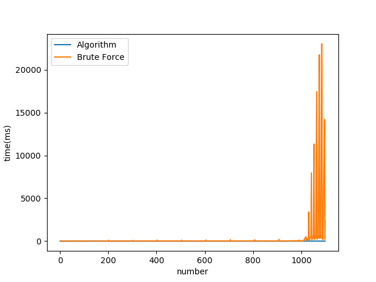
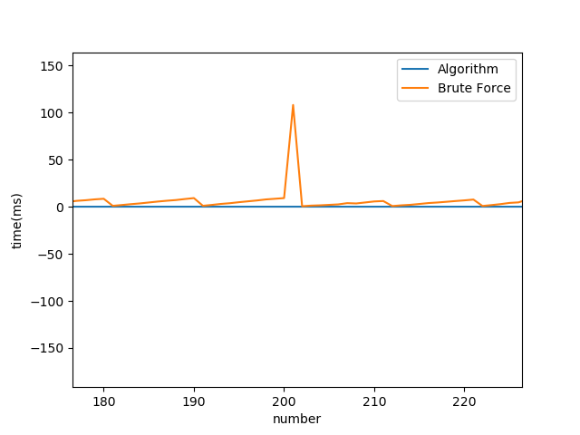
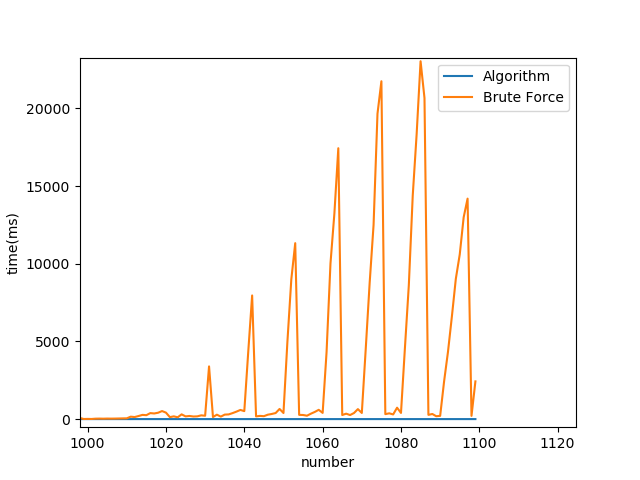

# sum_of_palindromes

## Working of Algorithm:
We first identify the number of digits.     
If it is between 2 to 5 or 6 digits with most significant digit = 1. Then we use special algorithms which are implemented in functions 
*sum_#_digits* where # is the number of digits.    
For bigger numbers we create a general algorithm which first divides the number into 13 categories(A1-A7, B1-B6) and initializes the first and last digits of each palindrome.   
We also check if number has odd no of digits and whether either of the central digits is 0 or not.
Depending on these conditions and category of number, we process the number through one(or more) of the 5 main algorithms. Each algorithm involves initializing the palindromes' first and last digits after which we iteratively find the numbers in the center.      
After each algorithm's raw run, There is a correction code that looks for anomalies in the three palindromes and make changes in numbers to keep the sum equal to number while making sure that all numbers are palindromes. This is known as the **Adjustment step**. After adjustment, the three palindromes are returned in the form of a tuple.

### Images:

**Command Line version:**    

**Web version:**    

**Comparision of naive approach and algorithm:**    

**Time for small values of n(100-200):**    

**Time for large values of n(1000-1100):**    

**For even larger values of n. The naive approach will take much much longer.**

> **Note:** There are sudden falls in time taken by Naive approach.    
> This happens when the number is very close to a palindrome.     
> Say we give 1011. So, we can break the number as    
> 1001 + 9 + 1    
> The other two palindromes are very small, this means the for loop will not run for a lot of values(We will encounter the break early) and hence the runtime is less.     
> But this happens for only some special cases and in general, the naive approach is still worse than our algorithm.

## How to run
**To run the console app**    
> Clone the repository or download zip.    
> Run the three_palindrome.py file using `python three_palindrome.py` command. Make sure you have python installed.    
> If you want to see the comparision. Head towards **additionals** folder and open images...    

**For running the test.py**    

> Install matplotlib module using `pip install matplotlib`    
> Run test.py using `python test.py`     

**For web version**    

> Install the required modules with `pip install -r requirements.txt`    
> Run the app.py file using `python app.py`     
> Go to browser and search `localhost:5000` or `127.0.0.1:5000`    

## Web version:
After creating the console version, I created a flask based website to give a more GUI based look.
In the web version, You have to fill the input box and submit. The program will make a post request and receive the three palindromes if the input given was correct, Otherwise it will give the prompt with error in input.

### Structure and Contents: 
1) naive_sum.py: Contains the brute force approach to calculate three palindromes such that their sum is equal to number given by user.
                  Program uses 3 nested loops to iterate over all triplets of numbers from (0,0,0) to (n,n,n) and stop when it finds the triplet such that all numbers are     
                  palindromes and sum is n. The time complexity is O(n^3) which is not very efficient. You can see the time taken by program to find triplets in comparision.png.
                  Orange line represents the time taken to find triplet for given n. It increases to great extend after n=1000.
                  We Can increase the efficiency by exploiting the fact that sum is constant with following code.        
                 
>                  for num1 in range(n):         
>                      for num2 in range(n):            
>                          num3 = n - (num1 + num2)             
>                          if ispalindrome(num1) and ispalindrome(num2) and ispalindrome(num3):             
>                              return (num1, num2, num3)      
                  
                  
2) three_palindrom.py:  It is the algorithmic implementation of _**'research_paper_3_palindrome.pdf'**_. When run, the code will prompt you to enter a number in decimal system.
                        If  the input is not of correct format, It will prompt the error and for input until a positive integer is entered. If user enters a positive float, it                           will take it's floor. The conversion may involve processing number through special algorithms(for 2-6 digit numbers) or a general algorithm(for 7 or more                         digits). Each time the number goes through general algorithm, program outputs the current value of number and the algorithm it is currently going                                 through. The final output is displayed in a box like format with 3 palindromes, their sum and a verdict whether the sum of palindromes is actually equal                         to initial number or not.
                        The time complexity of program is O(k) where k is the number of digits.

3) Static: Static folder contains the styling and the scripts for the web version of program. I have used SCSS and JQuery.

4) templates: It contains the html code for the web version.

5) Additionals:
      - test.py: it imports the naive and research algorithm code and runs for n=1 to 1000 and plots the time taken by both codes. After seeing the comparision images, it is                         obvious that our algorithm is much more efficient than the brute force approach.
      - research paper.pdf : It is the research paper based on which the whole code is written
