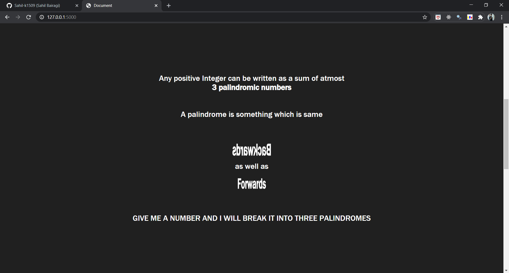
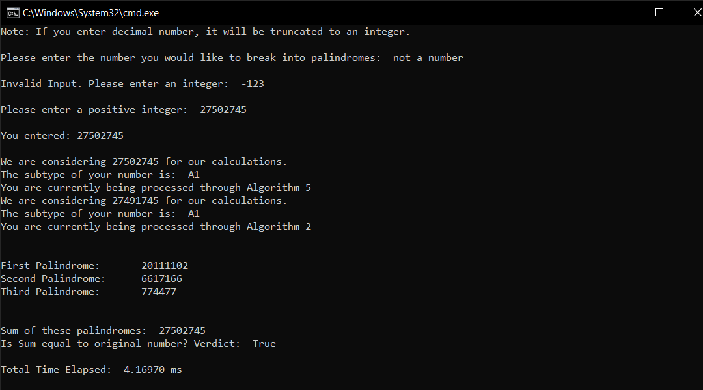
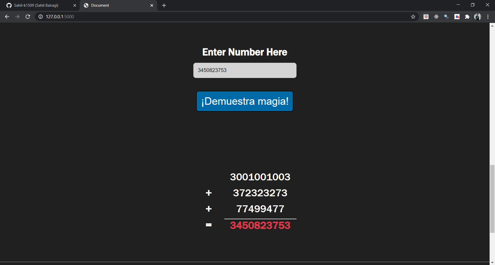
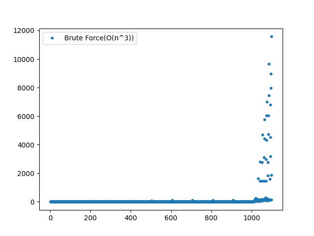
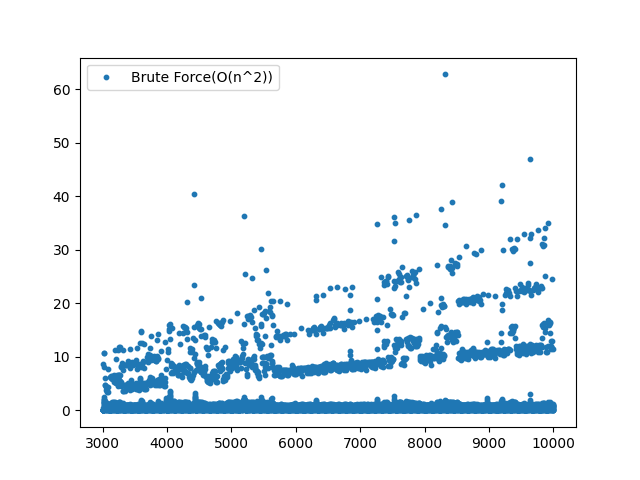
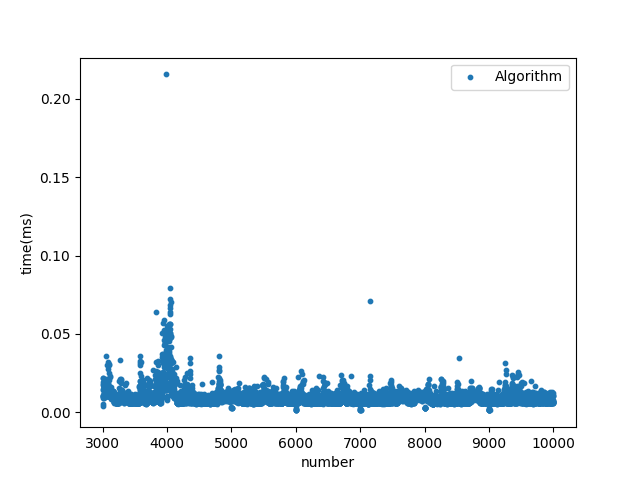

# sum_of_palindromes

## Working of Algorithm:
  

### Catergorizing the number:    
- First the number of digits are identified (let's say **k**).     
- If k is less than 7, number is processed through special algorithms depending on value of k.    
- Otherwise, number is processed through the general Algorithm.      

### Special Algorithms:      
- Initial guess on three palindromes is made based on the digits of number.    
- Then values are modified to make sure the numbers remain palindromes and sum is equal to given input.      
- After the adjustment step, three palindromes are returned in form of tuple.     

### General Algorithm:
- Number is subcategorized into 13 groups (A1-A6, B1-B7) and the first digit of palindrome is initialized.     
- Depending upon the subcategory and other factors, the number is processed through 1 (or more) of the 5 general algorithms.     
- Using the initialized digits from first step, other digits of palindromes are found iteratively.     
- Sometimes after identifying the first palindrome, a 2 to 6 digit number is left for which special algorithms are called.     
- Values are adjusted to make sure numbers are palindromes.      

  

  

**Command Line version:**    

**Web version:**    

  

**Brute Force Algorithm - O(n^3):**    

**Brute Force Algorithm - O(n^2):**    

**Research Paper Algorithm :**    

**Conclusion**     
The n^3 algorithm takes about 20s for even values of order 1000-1100.      
The optimized n^2 algorithm is significantly better but still fails for larger values of n (10000+).      
The research algorithm on the other hand more or less gives the result in constant time (Less than few milliseconds).     

> **Note:** There are some falls in time taken by Naive approaches.    
> This happens when the number is very close to a palindrome.     
> Say we give 1011. So, we can break the number as    
> 1001 + 9 + 1    
> The other two palindromes are very small, this means the for loop will not run for a lot of values(We will encounter the break early) and hence the runtime is less.     
> But this happens for only some special cases and in general, the naive approach is still worse than our algorithm.

## How to run
> Clone the repository or download zip. 
> Open the terminal.

**To run the console app**       

> Navigate to algorithms folder.
> Run the three_palindrome.py file using `python three_palindrome.py` command. Make sure you have python installed.    
> If you want to see the comparision. Head towards **additionals** folder and open images...    

**For running the test.py**    

> Navigate to algorithms folder
> Install matplotlib using `pip install matplotlib` commend    
> Run test.py using `python test.py`     

**For web version**    

> Install the required modules with `pip install -r requirements.txt`    
> Run the app.py file using `python app.py`     
> Go to browser and search `localhost:5000` or `127.0.0.1:5000`    
